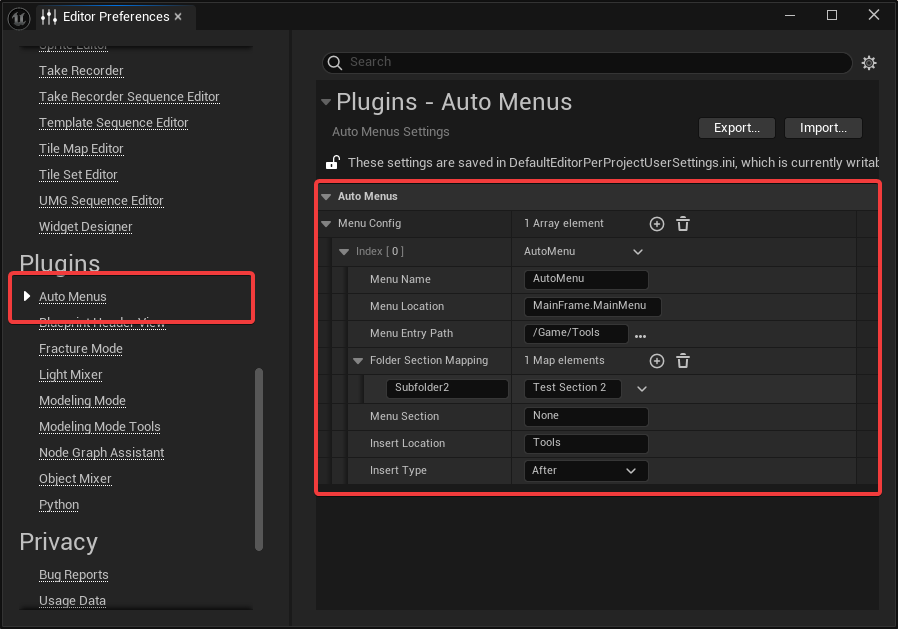

# Unreal AutoMenus

This plugin generates menus for your Editor Widget Blueprints (Blutility), preserving your original directory structure.

## Media

Screenshots, ...

## Features

- You can define multiple menus at different locations throughout the editor, using UI extension points.
- It will automatically extract window title, tooltip and section from your blueprints (resave required).
- Features menus, submenus and sub-submenus, following your directory hierarchy.
- Features sections within menus, for better structuring of your menu entries.
- Configuration-less: Only configure the menus, they will be filled with your tools automatically.
- Live: No need to restart the editor to make your tools appear when adding/changing your tools.

## Usage

Basic usage for the end user is, navigate the menu hierarchy and click on buttons.

Advanced usage means, placing new tool files into the proper folder structure, setting custom values to override menu entry details (e.g. tooltip), using shift-click to edit tools.

## Configuration

### Configure your menus

- Go to *Editor Preferences* -> *Auto Menus*
- Add menus to the *Menu Config* array.

Per menu, you can specify the following settings:

- *Menu Name*: The name of the menu
- *Menu Location*: The UI extension point in the editor. The menu will be created there.
- *Menu Entry Path*: The source folder, where your blueprint tools are located
- *Folder Section Mapping*: For each created submenu, you can specify which menu section they belong to.
- *Menu Section*: Section where to place the menu
- *Insert Location*: Another entry within the same menu. The new menu will be created relative to that.
- *Insert Type*: Type of relative placement of the new menu, relative to *Insert Location*.

For the *Folder Section Mapping*, use relative paths. For example, `MyFancySubmenu/MyOtherFancySubmenu` is a relative path within your *Menu Entry Path*.

**Common UI Extension Points:**

- `MainFrame.MainMenu`: Main Menu in all windows (The one with "File, Edit, Window, Tools, Help")
- `LevelEditor.LevelEditorToolBar.LevelToolbarQuickSettings`: Top-Right "Settings" menu in the level editor

### Configure your menu entries

All configuration of the menu entries happens within the widget blueprints themselves by adjusting/creating properties.

- The `Tab Display Name` of your tool will be used to set the menu entry title.
  - **If you don't set a tab name, the widget will be hidden from the menu!**
- The property `Tool Tip Text` will be used as a tool tip for that entry.
- You can create a *Name* property named `MenuSection`, which will be used to group your entries.

## License

MIT. See [License.txt](License.txt).